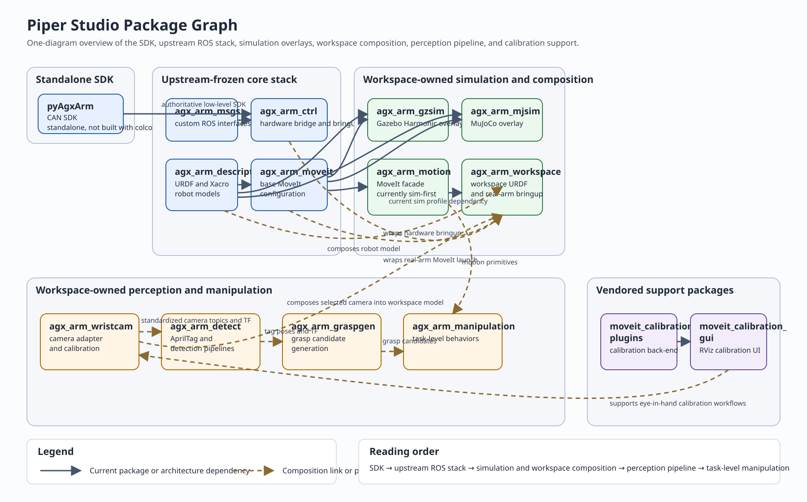
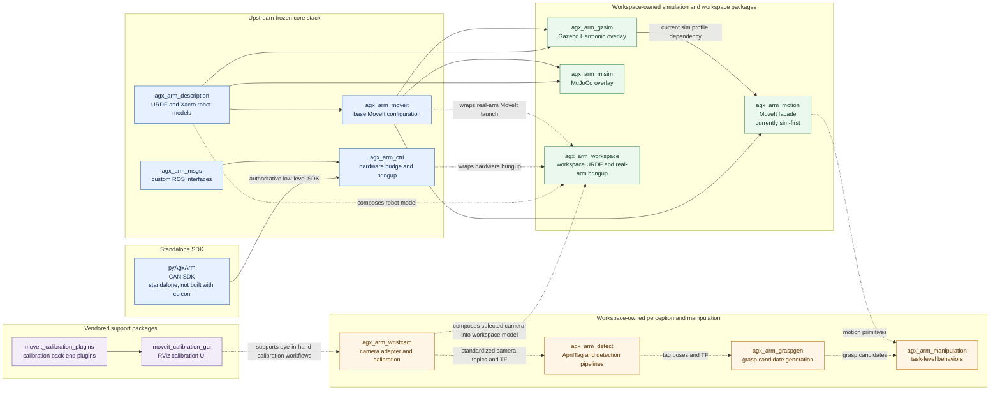

# Piper Studio Package Graph

This diagram is the fastest way to explain how the workspace is organized.
It includes every ROS package currently present under `src/`, grouped by role.

Solid arrows show current package or architecture dependencies that exist today.
Dashed arrows show launch-time composition or the intended perception-to-manipulation flow described in the workspace design.

## How to read it

- `pyAgxArm` is the authoritative hardware SDK and sits below the ROS driver.
- `agx_arm_ros` contains the upstream-frozen ROS bridge, robot description, messages, and base MoveIt config.
- `agx_arm_gzsim` and `agx_arm_mjsim` are alternative simulation overlays that reuse the same upstream description and MoveIt stack.
- `agx_arm_motion` is the convenience layer for motion primitives, but it is still tied to the Gazebo-backed sim profile today.
- `agx_arm_workspace` is the composition package for Piper-specific real-hardware bringup and workspace URDF assembly.
- `agx_arm_wristcam`, `agx_arm_detect`, `agx_arm_graspgen`, and `agx_arm_manipulation` form the planned perception-to-action pipeline.
- `moveit_calibration_plugins` and `moveit_calibration_gui` are vendored support packages for calibration workflows rather than Piper-specific application packages.

## Mermaid Source

