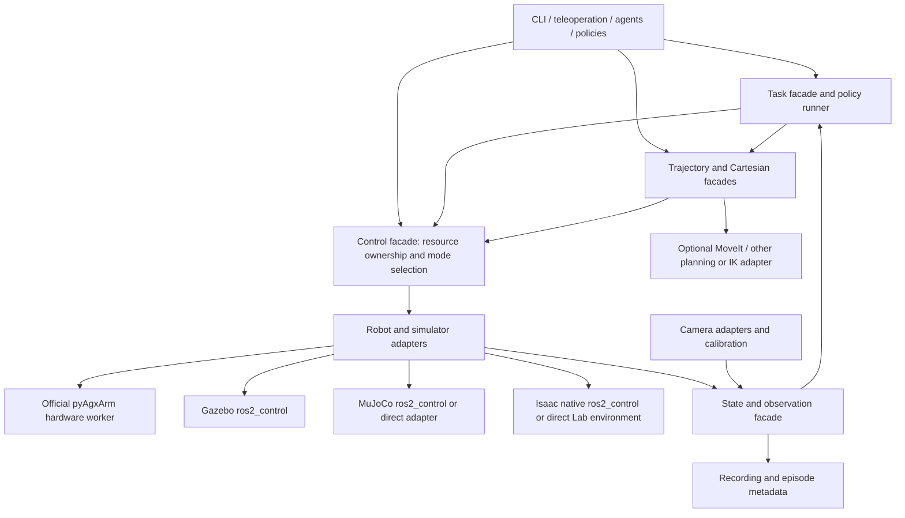

# Architecture proposal

Status: proposed, not implemented. Initial acceptance robot: standard AgileX Piper with AgileX gripper. ROS distribution: Jazzy. Host: Atlas. Additional robot variants and platforms are extensions, not prerequisites for the first working profile.

## 1. Responsibilities and control hierarchy

There is one command owner per physical resource. A planner, teleoperator, policy, and SDK utility must not each establish independent write paths to the same arm. Modes and ownership are explicit, including the handover between a trajectory controller and a streaming controller.

The hierarchy allows callers to select the abstraction appropriate to an experiment:

| Surface | Responsibility | MoveIt required? |
|---|---|---|
| State/observation facade | Measured robot state, validity, frames, synchronized observations | No |
| Control facade | Capability discovery, ownership, mode, bounded joint/gripper commands | No |
| Trajectory facade | Execute a timed joint trajectory with feedback and cancellation | No |
| Cartesian facade | IK, Cartesian targets, or streaming Cartesian commands | Only for the selected MoveIt planning/Servo adapter |
| Planning facade | Collision-aware plans, scene updates, execution through the control boundary | Optional implementation |
| Task facade | Approach/grasp/retreat and recovery using lower layers | Depends on the selected task |
| Policy runner | Map a versioned action specification to supported control surfaces | No |

The low-level SDK remains authoritative for firmware-specific CAN behavior. Generic code must not duplicate packet encoding, torque coefficients, firmware discovery, or gripper device behavior.

## 2. Core contracts

A small Python core should define typed state, command, result, capability, and observation records without importing ROS, MoveIt, Isaac, or a camera SDK. Transport-specific packages implement these contracts. Start with the interfaces exercised by Piper and two backends; avoid a speculative universal robotics framework.

### Robot specification and capabilities

A robot instance declares:

- Instance identity, semantic resource groups, ordered joint names, SI units, model identity, and transforms.
- Command/state interfaces and supported modes: joint position, velocity, effort, MIT impedance, trajectory execution, Cartesian commands, or base velocity as applicable.
- Firmware/model qualification, effective limits, supported gripper behavior, and required calibration.
- Backend and transport mappings between semantic names and native names.

Capabilities are discovered and checked. An unsupported effort or impedance command is rejected rather than emulated silently with position targets. Direct SDK access is an explicitly exclusive vendor-specific mode routed through the same owner.

For another robot platform, implement its adapter and configuration. An arm exposes arm/gripper resources; a mobile platform can expose base and other resources. Adding Go2 must not require an arm-only API to pretend that locomotion is a six-joint trajectory. Whole-body coordination is a later composition layer.

### Commands and results

Commands carry sequence/goal identity, resource group, mode, units, reference frame where relevant, timestamps/time domain, and validity bounds. Finite operations return an asynchronous handle with accepted/rejected, executing, completed, canceled, or failed status and a structured reason.

The execution result comes from execution and measured feedback. Planning success is not execution success. A cancel request has a reported outcome; a topic publication alone does not establish completion.

Streaming commands have freshness and ownership checks. Finite goals and streams have a defined preemption policy. Controller switching, stale feedback, command timeouts, and recovery require explicit behavior. A fault response must be chosen for the hardware and load; indiscriminately disabling motors can drop a gravity-loaded arm.

Hardware watchdogs use monotonic elapsed time. ROS/simulator timestamps remain available for observations and trajectories; clock resets and paused simulation require separate handling. This architecture does not claim hard real-time guarantees from a Python process or DDS.

### State and observations

State includes measured positions, velocities, available effort estimates, sample timestamps, freshness, validity, hardware/mode status, and provenance. Estimated effort must not be labelled as a calibrated torque measurement.

Observations combine robot state and named sensors with per-sample timestamps. Eye-in-hand transforms use observation time. A synchronization policy specifies acceptable skew and missing/stale samples; it must not silently substitute the newest transform for a recorded image pose.

ROS facades adapt standard actions, services, and messages where possible. CLI and non-ROS callers use the same logical semantics. Resource names and ROS namespaces are instance-scoped; `/piper/...`, `base_link`, and fixed camera topics must not be embedded in generic logic.

## 3. Hardware and ROS control

The first hardware baseline uses the current official SDK and ROS bridge, qualified against the arm firmware. No hardware process is started merely to test imports or configuration.

The official MoveIt configuration currently uses a mock ros2_control system and forwards control states into the SDK bridge. Preserve this as a reference path, but distinguish its mock controller state from measured hardware feedback.

Evaluate a maintained topic-based hardware interface between ros2_control and the official bridge. It should feed measured state into the trajectory controller and retain the vendor SDK. Qualification includes feedback loss, startup state synchronization, controller ownership, gripper semantics, activation/deactivation behavior, and commands issued during mode changes.

A native C++ CAN driver is an alternative only after its firmware/protocol coverage, startup motion, units, error handling, and ownership behavior are reviewed. Lower latency alone is not enough to replace the vendor SDK.

The ROS profile should expose standard trajectory execution and appropriate streaming controllers. The non-ROS profile can operate the official SDK through the same control contracts without MoveIt or ROS imports. A trajectory runner is a separate required capability; an adapter that only supports joint targets cannot claim full trajectory semantics by applying the final sample.

Choose one planning-scene authority per ROS profile. The default proposal is `move_group` with client facades. Embedded MoveItPy remains an optional experimental profile with explicit scene ownership; do not launch both by default and assume synchronization.

## 4. Description, calibration, and gripper semantics

Use a pinned official arm/gripper description as the geometry and kinematic source. Compose tool, payload, mounts, robot-instance frames, and sensors in a workspace-owned overlay. Keep a documented patch list when an upstream defect or hardware measurement requires a correction.

The description pipeline produces or qualifies:

1. Expanded ROS URDF and matching MoveIt semantics/configuration.
2. MuJoCo model with reproducible conversion plus explicit collision/contact/actuation refinements.
3. Isaac USD articulation with reproducible import settings and explicit drive/collision refinements.
4. Gazebo composition using the same semantic model.

Generated artifacts record source hashes, converter versions, settings, and overlay hashes. Isaac-generated robot descriptions and external ROS publishers must have one selected owner and compatible geometry.

Parity checks cover joint axes/order/signs, limits, flange/TCP transforms, mimic relations, mesh units, mass/COM/inertia conservation when fixed bodies are merged, and FK over representative configurations. Controller tuning and contact parameters are backend-specific and separately qualified.

Published effort/velocity limits and inertias have provenance: manufacturer, CAD estimate, measurement, or provisional configuration. The old URDF's 100 Nm effort entries must not become assumed hardware ratings. Domain randomization should be based on stated uncertainty after a coherent nominal model exists.

Expose one gripper aperture `w` in metres. Current official descriptions use a virtual `gripper` joint with opposing mimic jaws. Adapters translate width into the SDK/simulator representation; independent jaw control is not presented as a capability of the normal gripper. Effective travel is confirmed for the actual hardware and can be narrower than the description's 100 mm range.

Define flange, gripper base, TCP, camera mount, and optical frames explicitly. Camera calibration and TCP offsets are distinct assets with identity, version, source, and validity. When mounted on Go2, use a documented fixed mounting transform and instance-scoped frames without duplicate TF authorities.

## 5. Sensors, recording, and VLA integration

Camera adapters wrap maintained vendor drivers and normalize streams, CameraInfo, encodings, units, optical frames, and timestamps. They also support simulator and replay sources. Downstream perception depends on this interface, not on the camera vendor. Implement the actual mounted camera first; additional vendors are optional adapters.

Recording has two layers: raw streams suitable for replay and an episode index/metadata description suitable for policy training. ROS profiles can use rosbag2; direct profiles need an equivalent recorder adapter. Exporters to LeRobot or another framework are optional and versioned, rather than the only storage definition.

An episode records at least:

- Robot and model identities, source revisions, firmware, calibration, controller mode and gains.
- Observation/action specification, units, frames, joint order, time domains, synchronization policy, and measured state.
- Issued commands, their acceptance/execution outcomes, dropped or interrupted chunks, and task/episode boundaries.
- Policy identity/version, preprocessing and normalization, action cadence, and backend.

Datasets, weights, and large generated assets live under the machine's data roots, with owner/source notes. Commit metadata and small fixtures; do not commit recordings or environments.

A policy action specification declares joint versus Cartesian representation, absolute versus delta targets, quaternion convention, reference frame, gripper semantics, normalization, chunk timing, and validity. The runner validates it against robot/controller capabilities. Policy outputs pass through the same ownership and command boundary used by traditional control.

Policies, agents, and teleoperation can therefore share the robot, but cannot simultaneously command the same resource. Observation latency, action-chunk cancellation, and handover must be tested using mock/simulator/replay profiles before hardware deployment.

## 6. Package and dependency organization

Proposed responsibilities, with final names decided during implementation:

| Component | Scope |
|---|---|
| Core contracts/facades | Robot-independent typed interfaces; no required ROS or planner dependency |
| Piper adapter | Official SDK/ROS integration, firmware qualification, native-to-semantic mapping |
| ROS integration | Actions, services, measured-state ros2_control integration, controller configuration |
| MoveIt adapter | Planning-scene ownership, planning/execution clients, optional Servo/MTC integration |
| Backend packages | Gazebo, MuJoCo, and Isaac-specific launch/model/controller glue |
| Sensor/calibration adapters | Vendor/sim/replay cameras, mounts, calibration metadata |
| Recording/policy adapters | Episode bookkeeping and optional learning-framework exporters/runners |
| Workspace/cell composition | Robot instances, mount/tool selections, task configuration, profile entry points |

Use existing `agx_arm_*` packages where their responsibilities fit; rename only when it reduces coupling or clarifies a reusable public interface. Do not create one package for every facade by default.

Prefer a monorepo for tightly coupled workspace-owned packages and pinned external dependencies for vendor/reusable projects. Preserve source history and licences before any consolidation. Until that migration is agreed, retain the current submodule layout and archive refs. Decide whether Git submodules or a SHA-pinned vcstool manifest owns source versions; avoid conflicting authoritative locks.

Profiles declare required features. The basic mock/direct-control profile must not import MoveIt, camera SDKs, Isaac, or policy frameworks. Heavy simulator/learning environments are isolated. The installed shared Isaac environment remains unchanged.

## 7. Reliability and maintenance

- Bootstrap reports dependency changes before installing and distinguishes workspace installs from system/shared-environment changes requiring approval.
- Lock source revisions and Python dependencies; record ROS/OS package versions and binary ABI constraints. Pinning Python packages alone does not make the ROS installation hermetic.
- Recreate relocated environments and overlays; do not repair generated setup files piecemeal.
- CI runs static/model/core checks and mock execution. Backend checks run headless where available; GPU tests use the shared-machine scheduler.
- A profile is supported only after its acceptance evidence is recorded. Hardware and impedance/RL profiles remain separate qualification levels.
- Upgrade vendor sources as a compatible set on an integration branch, examine firmware-related changes, run the qualification suite, and retain a rollback lock.

## 8. Decisions requiring user review

Agree the source-management/consolidation strategy, default planning owner, and whether position-control qualification precedes impedance work. Confirm the actual camera, firmware, gripper travel, and mounting measurements before hardware-specific calibration or validation. Repository restructuring, shared/system installs, firmware changes, and real-arm movement are separate actions; this proposal performs none of them.
